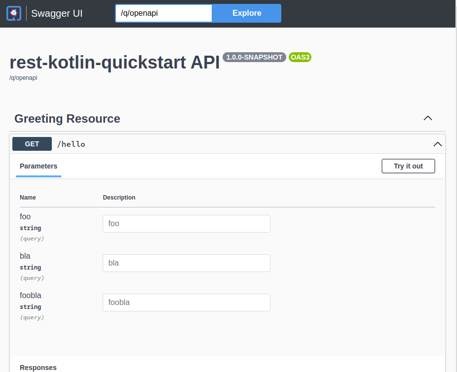

# Showcase quarkus + openapi suspend issue

When using `quarkus`, `smallrye-open-api` and `suspend` functions,
the generated openapi file merges the `@QueryParam` definitions:

The following resource definition

```kotlin
@Path("/hello")
class GreetingResource {

    @GET
    @Produces(MediaType.TEXT_PLAIN)
    suspend fun foo(
        @QueryParam("foo") foo: String
    ) = "Hello from RESTEasy Reactive"

    @POST
    @Produces(MediaType.TEXT_PLAIN)
    suspend fun bla(
        @QueryParam("bla") bla: String
    ) = "Hello from RESTEasy Reactive"

    @DELETE
    @Produces(MediaType.TEXT_PLAIN)
    suspend fun foobla(
        @QueryParam("foobla") bla: String
    ) = "Hello from RESTEasy Reactive"
}
```

leads to



## Steps to reproduce

1. `git clone git@github.com:judomu/smallrye-open-api-issue-suspend-merging.git`
2. `cd smallrye-open-api-issue-suspend-merging` 
3. `quarkus dev`
4. see issue at `http://localhost:8080/q/swagger-ui`
